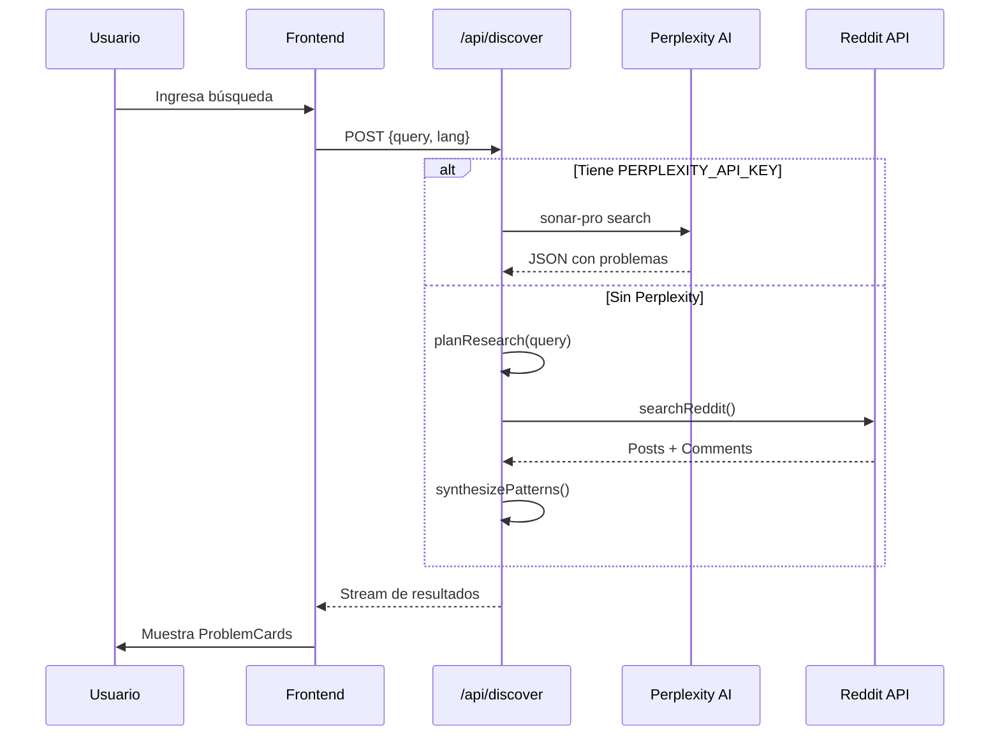

# 💎 Veta - SaaS Problem Discovery Platform

> **Descubre problemas rentables para tu próximo SaaS analizando conversaciones reales de Reddit y foros con IA.**


---

## 📋 Descripción

**Veta** es una plataforma de investigación de mercado impulsada por IA que ayuda a emprendedores y fundadores a descubrir **problemas reales** que la gente está discutiendo en Reddit, Hacker News y otros foros. En segundos, analiza miles de conversaciones y extrae:

- 🎯 **Puntos de dolor verificados** con puntuación de oportunidad
- 💰 **Disposición a pagar** con evidencia real
- 🧑‍💼 **Personas objetivo** específicas
- 💡 **Ideas de MVP** listas para construir
- 📞 **Estrategias de contacto** para encontrar primeros clientes

---

## ✨ Características Principales

| Característica | Descripción |
|----------------|-------------|
| 🔍 **Búsqueda Inteligente** | Analiza Reddit, HN y foros en inglés/español |
| 🤖 **IA Perplexity** | Análisis profundo con el modelo `sonar-pro` |
| 📊 **Métricas de Señal** | Frecuencia, Intensidad, Monetización, WTP |
| 📄 **Exportación PDF** | Descarga reportes completos |
| 🌐 **Multilenguaje** | Soporte completo Inglés/Español |
| 💳 **Pagos MercadoPago** | Suscripciones Pro integradas |
| 🔐 **Autenticación Supabase** | Login seguro con Google/Email |

---

## 🏗️ Arquitectura

```
dolores/
├── app/                      # Next.js App Router
│   ├── api/
│   │   ├── discover/         # Endpoint principal de búsqueda
│   │   ├── create-subscription/
│   │   ├── webhook/          # Webhook MercadoPago
│   │   └── admin/
│   ├── app/                  # Dashboard principal
│   ├── auth/                 # Páginas de autenticación
│   ├── payment/              # Success/Failure/Pending pages
│   ├── pricing/              # Página de precios
│   └── page.tsx              # Landing page
├── components/
│   ├── HeroInput.tsx         # Input de búsqueda principal
│   ├── ProblemCard.tsx       # Tarjeta de problema (400 líneas)
│   ├── Sidebar.tsx           # Navegación lateral
│   ├── MatrixChart.tsx       # Gráfico de oportunidades
│   ├── UpgradeModal.tsx      # Modal de upgrade
│   └── WhatsAppButton.tsx    # Botón de contacto
├── lib/
│   ├── perplexity.ts         # Cliente Perplexity API
│   ├── reddit.ts             # Scraper Reddit JSON API
│   ├── openai.ts             # Funciones agenticas (planner, extractor, synthesizer)
│   ├── supabase.ts           # Cliente Supabase
│   ├── analytics.ts          # Tracking de eventos
│   └── translations.ts       # i18n completo (~32KB)
├── hooks/
│   └── useSubscription.ts    # Hook de suscripciones + usage tracking
├── context/
│   ├── AuthContext.tsx       # Estado de autenticación
│   └── LanguageContext.tsx   # Estado de idioma
└── supabase/
    └── schema.sql            # Esquema de base de datos
```

---

## 🗃️ Esquema de Base de Datos

### Tablas Principales

```sql
-- Historial de búsquedas
search_history (id, user_id, query, result_count, created_at)

-- Reportes guardados
saved_reports (id, user_id, title, query, problem_count, results, created_at)

-- Plantillas guardadas
saved_templates (id, user_id, name, query, created_at)

-- Suscripciones (Pro/Free)
subscriptions (id, user_id, email, plan_type, status, payment_id, ...)

-- Tracking de uso mensual
usage_tracking (id, user_id, month_year, search_count, ...)
```

---

## 🔄 Flujo de Búsqueda



---

## 💳 Modelo de Suscripción

### Plan Free
- ✅ **1 búsqueda** por mes
- ✅ Resultados completos (sin blur)
- ❌ Sin historial ilimitado

### Plan Pro ($150 USD/mes)
- ✅ Búsquedas ilimitadas
- ✅ Análisis completo con IA
- ✅ Historial ilimitado
- ✅ Reportes guardados
- ✅ Plantillas personalizadas
- ✅ Soporte prioritario

---

## ⚙️ Variables de Entorno

```env
# Supabase
NEXT_PUBLIC_SUPABASE_URL=https://xxx.supabase.co
NEXT_PUBLIC_SUPABASE_ANON_KEY=eyJ...
SUPABASE_SERVICE_ROLE_KEY=eyJ...

# AI
PERPLEXITY_API_KEY=pplx-xxx          # Para búsqueda principal
OPENAI_API_KEY=sk-xxx                # Para pipeline fallback

# Pagos
MERCADOPAGO_ACCESS_TOKEN=APP_USR-xxx
NEXT_PUBLIC_MERCADOPAGO_PUBLIC_KEY=APP_USR-xxx
NEXT_PUBLIC_APP_URL=http://localhost:3000

# Analytics (opcional)
NEXT_PUBLIC_GA_ID=G-xxx
```

---

## 🚀 Instalación

```bash
# Clonar repositorio
git clone <repo-url>
cd dolores

# Instalar dependencias
npm install

# Configurar variables de entorno
cp .env.example .env.local
# Editar .env.local con tus credenciales

# Ejecutar migraciones de Supabase
# (Copiar contenido de supabase/schema.sql a SQL Editor)

# Iniciar servidor de desarrollo
npm run dev
```

Abrir [http://localhost:3000](http://localhost:3000)

---

## 📦 Dependencias Principales

| Paquete | Versión | Propósito |
|---------|---------|-----------|
| `next` | 16.1.1 | Framework React |
| `react` | 19.2.3 | Librería UI |
| `@supabase/supabase-js` | 2.89.0 | Auth + Database |
| `mercadopago` | 2.11.0 | Pagos |
| `openai` | 6.15.0 | Pipeline alternativo |
| `framer-motion` | 12.23.26 | Animaciones |
| `recharts` | 3.6.0 | Gráficos |
| `jspdf` | 3.0.4 | Generación PDF |
| `lucide-react` | 0.562.0 | Iconos |
| `tailwindcss` | 4.x | Estilos |

---

## 🧪 Testing

```bash
# Lint
npm run lint

# Build de producción
npm run build
```

### Tarjetas de Prueba MercadoPago
- **Aprobada**: `5031 7557 3453 0604`
- **Rechazada**: `5031 4332 1540 6351`
- Usar cualquier fecha futura y CVV

---

## 📁 Archivos de Configuración

| Archivo | Descripción |
|---------|-------------|
| `ENV_SETUP.md` | Guía de configuración de variables |
| `MERCADOPAGO_SETUP.md` | Integración completa de pagos |
| `DEBUG.md` | Notas de debugging |
| `supabase/schema.sql` | Esquema completo de BD |

---

## 🎨 Tema Visual

- **Fondo**: `#0A0A0A` (casi negro)
- **Cards**: `#0F0F0F`, `#111111`, `#1A1A1A`
- **Bordes**: `#222222`, `#333333`
- **Acentos**: Azul (`#3B82F6`), Púrpura (`#A855F7`), Rosa (`#EC4899`)
- **Colores señal**: Rojo (alta urgencia), Ámbar (frecuencia), Verde (WTP)

---

## 📱 Componentes Clave

### `ProblemCard.tsx`
Tarjeta principal que muestra cada problema encontrado:
- Header con ranking y persona objetivo
- Score de señal (1-10)
- Métricas visuales (frecuencia, intensidad, WTP, monetización)
- Soluciones existentes con quejas
- Ideas de MVP numeradas
- Estrategia de contacto
- Citas textuales expandibles

### `HeroInput.tsx`
Input de búsqueda con:
- Animación de placeholder rotativo
- Ejemplos clickeables
- Estado de carga integrado

### `useSubscription.ts`
Hook que maneja:
- Estado de suscripción (free/pro)
- Conteo de búsquedas mensual
- Límites y paywalls
- Suscripción realtime a cambios de BD

---

## 🌐 Internacionalización

El archivo `lib/translations.ts` contiene traducciones completas para:
- 🇺🇸 Inglés (`en`)
- 🇪🇸 Español (`es`)

Incluye: landing page, dashboard, pricing, modals, errores, y más.

---

## 📞 Soporte

- **WhatsApp**: Botón flotante integrado
- **Email**: Configurado en componentes

---

## 📝 Licencia

Proyecto privado - Todos los derechos reservados.

---

*Última actualización: Enero 2026*
